## Box-model
W projekcie dla właściwości box-sizing zastosowano prametr border-box, dzięki czemu włączono padding oraz border do całkowitej szerokości oraz wysokości elementów.  
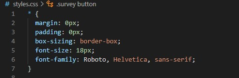

Elementy zostały odrębnie ostylowane przy użyciu margin, padding oraz border.  
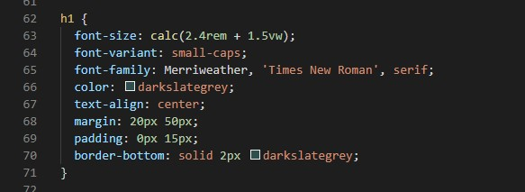

## Kaskadowość CSS
Kaskadowość CSS widoczna jest w stylowaniu złożonych elementów strony.
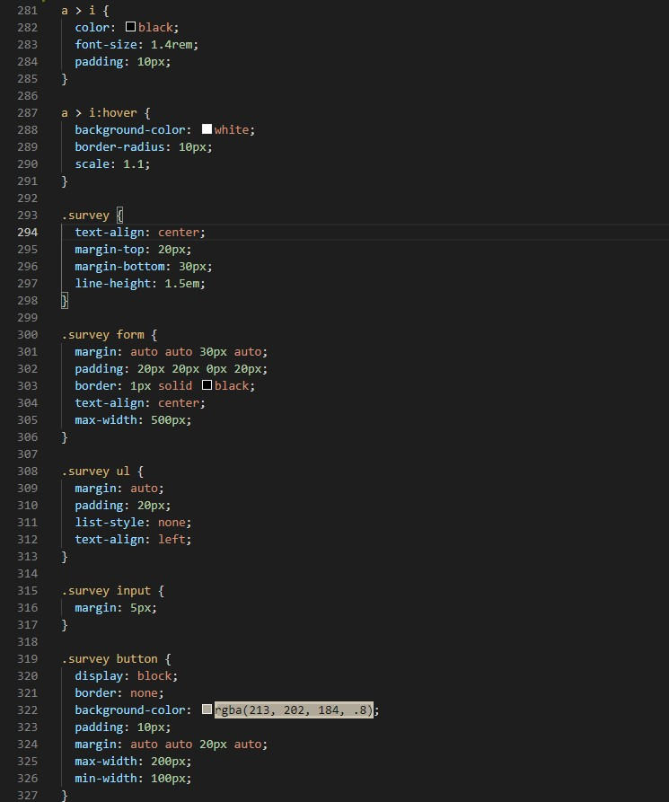

## Selektory CSS
W kodzie CSS użyto głównie selektorów class, pseudoklas, sekletorów potomka (X Y) oraz bezpośrednich dzieci (X > Y).  
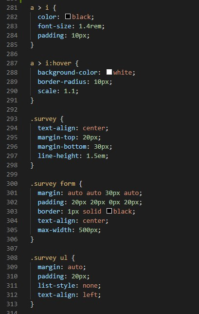

## Popularne tagi HTML
W kodzie HTML zastosowano podstawowe tagi (takie jak html, div, p itp.), tagi semantyczne (header, main, footer, nagłówki h1, h2, h3, podział na sekcje itp).  
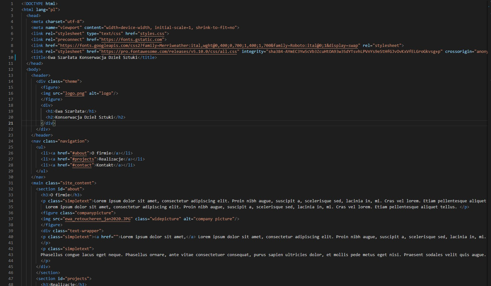

## Jak podpinać CSSa do HTMLa
Plik CSS podpięto w sekcji head.  
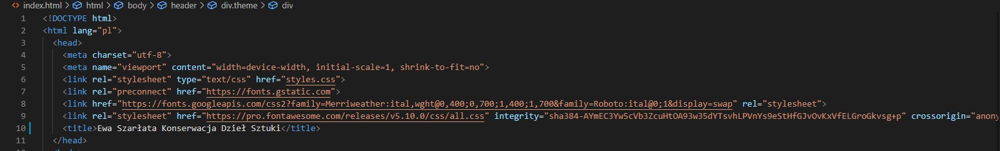

## Zapisywanie kolorów
Zostosowane zostały kolory w formacie RGBA, RGB, oraz posiadające nazwy.  
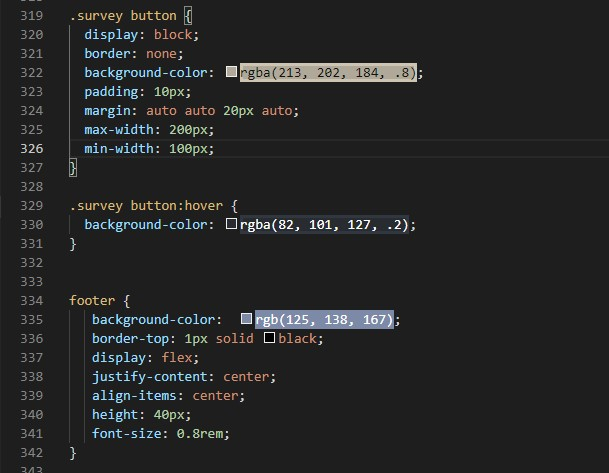

## Stylowanie tekstu
Stylowanie zostało zastosowane przy wszystkich elementach tekstowych.

    
## Zewnętrzne ikony/fonty (fontawesome, google fonts)
Zewnętrzne ikony oraz fonty podpięto w sekcji head.  

Wykorzystano fonty Roboto (jako domyślny dla strony) oraz Merriweather jako ozdobny font dla nagłówków.  
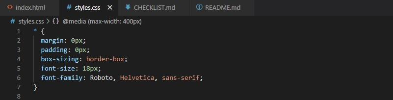

Wykorzystano ikony Font Awsome.
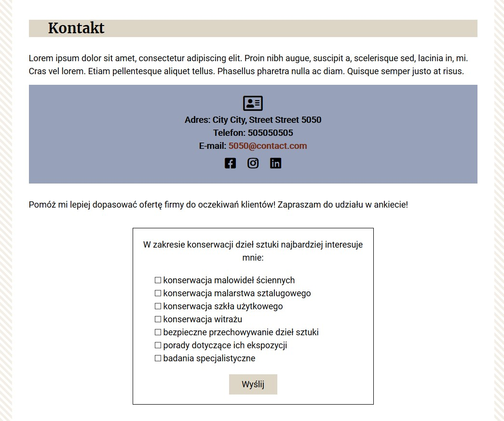

## Flexbox i/lub CSS Grid
Flexboxa zastosowano dla elementów w sekcji header oraz dla nawigacji.  
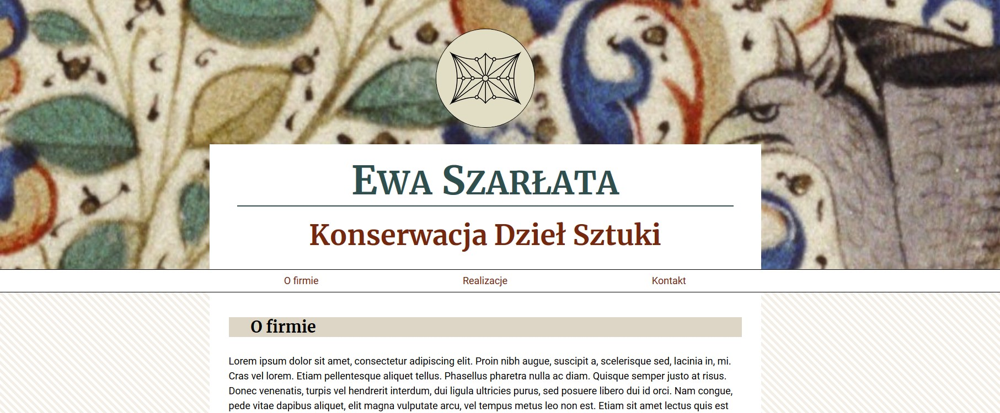
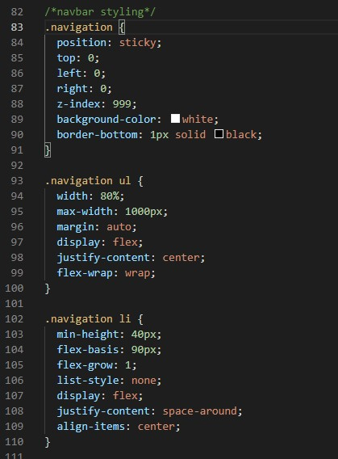

Grid został użyty w sekcji "Projekty".  ## Box-model
W projekcie dla właściwości box-sizing zastosowano parametr border-box, dzięki czemu włączono padding oraz border do całkowitej szerokości oraz wysokości elementów.  

Elementy zostały odrębnie ostylowane przy użyciu margin, padding oraz border.  

## Kaskadowość CSS
Kaskadowość CSS widoczna jest w stylowaniu złożonych elementów strony.

## Selektory CSS
W kodzie CSS użyto głównie selektorów class, pseudoklas, sekletorów potomka (X Y) oraz bezpośrednich dzieci (X > Y).  

## Popularne tagi HTML
W kodzie HTML zastosowano podstawowe tagi (takie jak html, div, p itp.), tagi semantyczne (header, main, footer, nagłówki h1, h2, h3, podział na sekcje itp).  

## Jak podpinać CSSa do HTMLa
Plik CSS podpięto w sekcji head.  

## Zapisywanie kolorów
Zastosowane zostały kolory w formacie RGBA, RGB, oraz posiadające nazwy.  

## Stylowanie tekstu
Stylowanie zostało zastosowane przy wszystkich elementach tekstowych.

    
## Zewnętrzne ikony/fonty (fontawesome, google fonts)
Zewnętrzne ikony oraz fonty podpięto w sekcji head.  

Wykorzystano fonty Roboto (jako domyślny dla strony) oraz Merriweather jako ozdobny font dla nagłówków.  

Wykorzystano ikony Font Awsome.

## Flexbox i/lub CSS Grid
Flexboxa zastosowano dla elementów w sekcji header oraz dla nawigacji.  

Grid został użyty w sekcji "Projekty".  
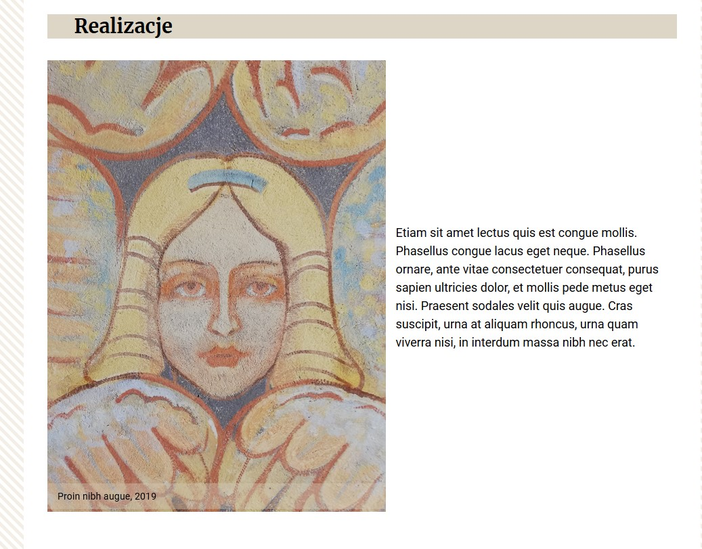

## Position (absolute, relative)
W projekcie wykorzystano position: absolute, relative oraz sticky. Position absolute było przydatne przy wykonywaniu podpisów dla zdjęć znajdujących się w animacji. Position dla zdjęć zostało ustawione na relative. Nawigacja posiada wartość sticky dzięki czemu po jej minięciu w trakcie scrollowania strony przemieszcza się ona do górnej krawędzi okna przeglądarki.  

## Animacje keyframes
Animacja keyframes została użyta do stworzenia galerii zdjęć oraz dla selektora section:target, tak, aby po przejściu do odpowiedniej sekcji strony dzięki nawigacji, pojawiał się dynamiczny efekt zaznaczenia (border) po obu stronach sekcji.  
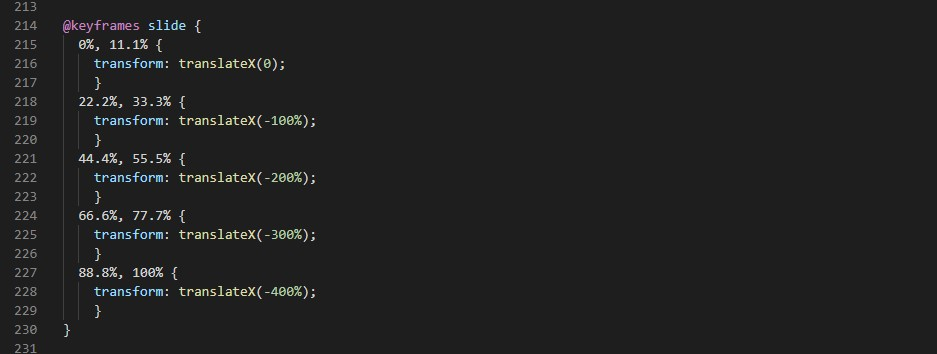
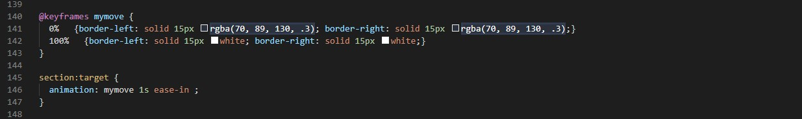

## Formularz (wysłanie formularza może powodować przeładowanie strony, gdyż w kursie nie - było jeszcze jego obsługi)
Na stronie pojawia się formularz ankiety.  

## Responsive Web Design
Wygląd strony został dostosowany do zmieniających się wymiarów okna przeglądarki dzięki zastosowaniu media queries (dopasowanych do wartości w których naturalnie zmienia się wygląd kompozycji strony), jednostek % oraz vh oraz vw. 
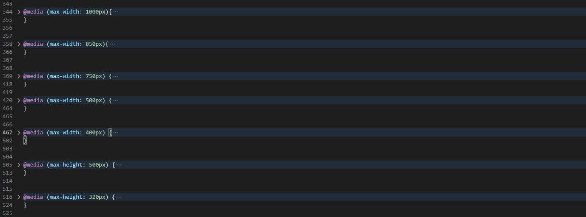
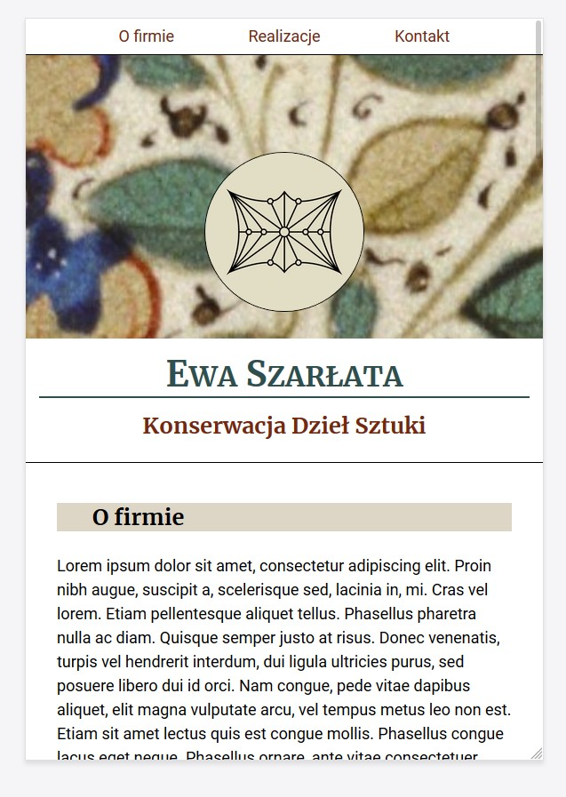

Rozmiar fontów nagłówków dopasowuje się do rozmiaru viewportu dzięki zastosowaniu wartości będącej wynikiem działania zapobiegającego zbyt szybkiemu skalowaniu rozmiaru pisma.  
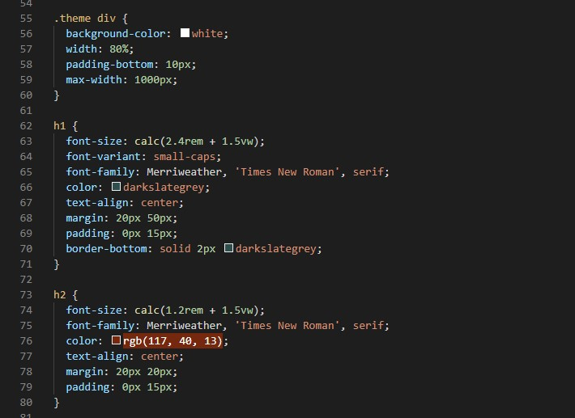

## Position (absolute, relative)
W projekcie wykorzystano position: absolute, relative oraz sticky. Position absolute było przydatne przy wykonywaniu podpisów dla zdjęć znajdujących się w animacji. Position dla zdjęc zostało ustawione na relative. Nawigacja posiada wartość sticky dzięki czemu po jej minięciu w trakcie scrollowania strony przemieszcza się ona do górnej krawędzi okna przeglądarki.  

## Animacje keyframes
Animacja keyframes została użyta do stworzenia galeri zdjęć oraz dla selektora section:target, tak, aby po przejściu do odpowiedniej sekcji strony dzięki nawigacji, pojawiał się dynamiczny efekt zaznaczenia (border) po obu stronach sekcji.  

## Formularz (wysłanie formularza może powodować przeładowanie strony, gdyż w kursie nie - było jeszcze jego obsługi)
Na stronie pojawia się formularz ankiety.  

## Responsive Web Design
Wygląd strony został dostosowany do zmieniających się wymiarów okna przeglądarki dzięki zastosowaniu media queries (dopasowanych do wartości w których naturalnie zmienia się wygląd kompozycji strony), jednostek % oraz vh oraz vw. 

Rozmiar fontów nagłówków dopasowuje się do rozmiaru viewportu dzięki zastosowaniu wartości będącej wynikiem działania zapobiegającego zbyt szybkiemu skalowaniu rozmiaru pisma.  

